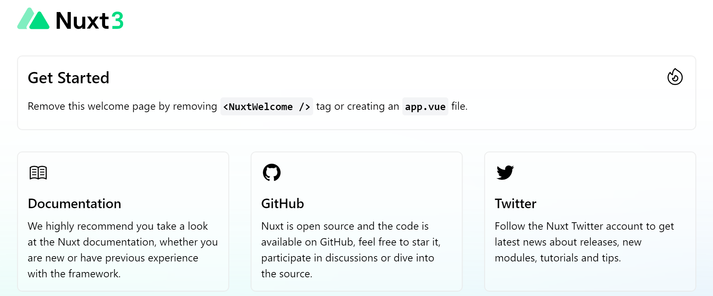
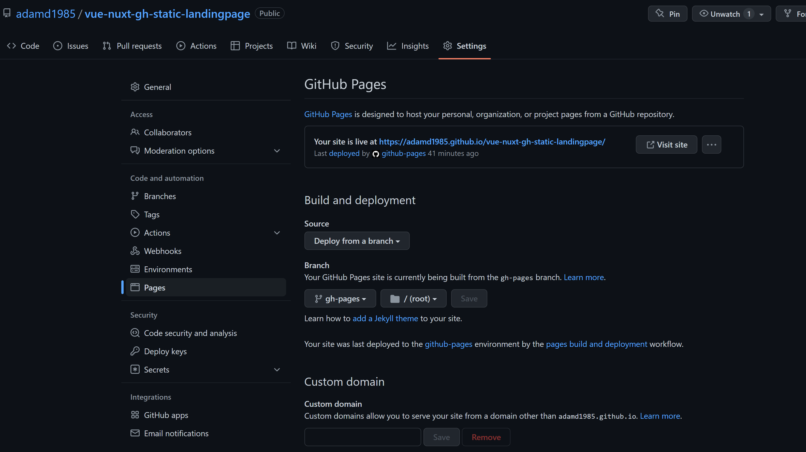
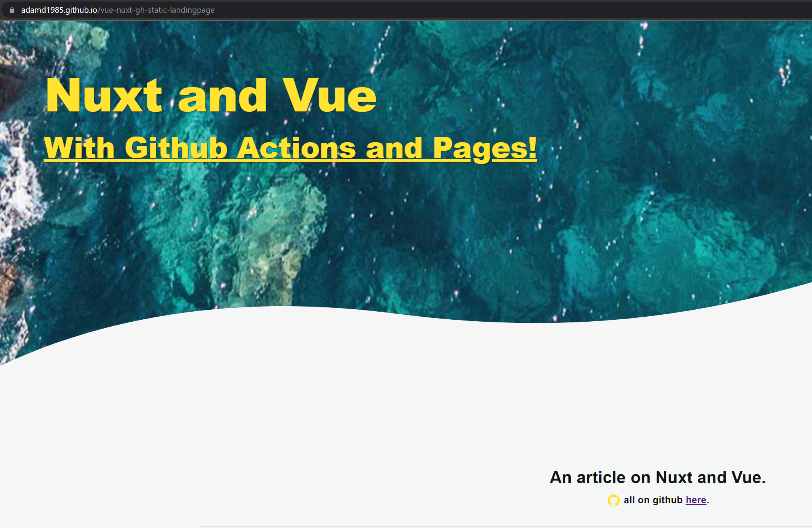

# Nuxt 3 and Vuejs - the Canvas for Building your Event's App 

 <!-- title: Nuxt 3 and Vuejs - the Canvas for Building your Event's App  -->


<!-- @import "[TOC]" {cmd="toc" depthFrom=1 depthTo=6 orderedList=false} -->
- [Nuxt 3 and Vuejs - the Canvas for Building your Event's App](#nuxt-3-and-vuejs---the-canvas-for-building-your-events-app)
- [Initiatlize your Project](#initiatlize-your-project)
- [Generate the content](#generate-the-content)
  - [Project Structure](#project-structure)
  - [Make it Beautiful](#make-it-beautiful)
  - [Land some Attendees](#land-some-attendees)
- [Build and Deploy](#build-and-deploy)
- [Github Pages For Hosting](#github-pages-for-hosting)
- [GitActions for Automation](#gitactions-for-automation)
- [Conclusion](#conclusion)
  - [References](#references)
  - [Github](#github)

NuxtJs is the defacto VueJs framework you would use to build your apps, these being Single Page App (SPA), Server-side Rendering (SSR), or Static-Site Generating (SSG). It's the latter that we will use to create an application for a sample event - to be forked by readers for their own landing pages.

Why Nuxt and a Static app? 

Nuxt simplifies and structures your projects, paving the path to enterprise-ready architecture with various CLIs and tools to boot. 
We choose a Static app, because we want a Universal Application, which is discoverable and optimized for various search engines, plus the usecase here is simple with no external content to load or manipulate.

The Nuxt shown here, is part of the release candidate 3, which is a major upgrade of the Nuxt used in the industry and wa released with VueJs' major update to version 3.

# Initiatlize your Project

For this project I will use *yarn* instead of *npm* to manage dependencies and build the app.

To setup a project, nuxt offers a simple command to run within your node environment:

`npx nuxi init app`

Go to the *app* directory, and install all packages with using an  *yarn install*. Once this is done, run an *yarn dev* and navigate to *http://localhost:3000/* in your browser.



Since out of the box, nuxt3 comes with typescript, we should leverage the typing benefits by adding the required liraries and configuring type checkings. 
Add the libraries with:

`yarn add -D vue-tsc typescript`

Go to *nuxt.config.ts* in the app directory and enable automatic typechecking:

```ts
export default defineNuxtConfig({
  typescript: {
   typeCheck: true,
 },
})
```

run the eslint command `npx eslint --init` and go through the options to select vue and typescript to generate the correct eslint configuration file.
For nuxt3, this is how our *.eslintrc.yaml* is configured:

```yml
env:
  browser: true
  es2021: true
extends:
  - plugin:vue/base
  - plugin:vue/vue3-recommended
  - plugin:@typescript-eslint/recommended
  - '@nuxtjs/eslint-config-typescript'
parser: 'vue-eslint-parser'
parserOptions:
  parser: "@typescript-eslint/parser"
  ecmaVersion: latest
  ecmaFeatures: 
    jsx: true
  sourceType: module
plugins:
  - vue
  - '@typescript-eslint'
```

Don't forget to add the **--fix** to the linting command created in your package.json.

# Generate the content

## Project Structure

Let's plan our event app. We know we want a landing page, a registration page with sends these somewhere and an articles page, so that our organizers can generate content to be displayed.
Breaking it down in a Nuxt structure, this is what we plan:

- | *public*/: robots.txt and favicon.ico. These we will copy, nuxt won't touch them.
- | *plugins*/: Additional libraries, in our case we will add Vuetify.
- | *assets*/: Images and CSS we will deploy to the users. These will be packaged and altered with the baseurl.
  - | css
  - | img
- | *components*/: Pages we will deploy. Nuxt will automatically import anything here.
  - | *AboutSection.vue*: Put info about our event.
  - | *ContactSection.vue*: How to register.
  - | *FooterSection.vue*: The footer bar.
  - | *HomeSection.vue*: The main banner and any info.
- | *app.vue*/: Our index page which will load all others.

Let's start with a simple html section for our *app.vue*, to verify this setup works. We do this by replacing the default Nuxt3 *NuxtWelcome*:

```tsx
<template>
  <div>
    <h1>Landing</h1>
    <p>If you see this, you navigated to the landing page.</p>
  </div>
</template>
```

Running the *yarn dev* should load a server pointing to the index page we just created.

## Make it Beautiful

Our app should be pretty, and what better way to do this than to add a *Vuetify* template:

```bash
yarn add vuetify@next sass @mdi/font
yarn add  -D vuetify@next vite-plugin-vuetify @fortawesome/fontawesome-free 
```

In the plugin directory, we need to add *vuetify.ts* for the veutify configurations:
```tsx
import '@mdi/font/css/materialdesignicons.css'
import { createVuetify } from 'vuetify'
import * as components from 'vuetify/components'
import * as directives from 'vuetify/directives'

export default defineNuxtPlugin((nuxtApp) => {
  const vuetify = createVuetify({
    components,
    directives
  })

  nuxtApp.vueApp.use(vuetify)
})

```

Extend *nuxt.config.ts* to include vuetify and some other nice things, like the favicon and metadata:

```ts
export default defineNuxtConfig({
  ...
  head: {
    link: [
      { rel: 'stylesheet', href: 'https://fonts.googleapis.com/css?family=Oswald|Libre+Baskerville&display=swap' },
      { hid: 'icon', rel: 'icon', type: 'image/x-icon', href: 'favicon.ico' }
    ],
    titleTemplate: 'Vue +Nuxt3 with GH pages and Actions',
    meta: [
      { charset: 'utf-8' },
      { hid: 'description', name: 'CVue +Nuxt3 with GH pages and Actions.', content: 'Meta description' }
    ]
  },
  css: ['vuetify/lib/styles/main.sass', '@/assets/css/main.scss'],
  build: {
    transpile: ['vuetify']
  },
  plugins: ['~/plugins/vuetify.ts'],
```

Let's make our home page beautiful in *app.vue* more beautiful:

```tsx
<template>
  <div class="pt-8 mt-4">
    <v-card
      class="mx-auto rounded-xl"
      width="600"
      prepend-icon="mdi-home"
    >
      <template v-slot:title>
        Landing with Veutify
      </template>
      <v-card-text class="text-center">
        If you see this, you navigated to the prettier landing page
      </v-card-text>
    </v-card>
  </div>
</template>
```


## Land some Attendees

Now we buld our landing page according to the plan.

# Build and Deploy

We will build a Static site generation (SSG), which means it pre-renders every route of our app so navigation happens organically through html pages. Nuxt does this with a crawler to generate each HTML file. Add these configurations to the **nuxt.config.ts** to hint that we want a full static, not and preview version - which would have fetch API calls to each static page:

```ts
export default defineNuxtConfig({
  ...
  mode: 'universal',
  target: 'static',
  ssr: false,
  router: {
    base: '/vue-nuxt-gh-staticlanding'
  },
  app: {
    baseURL: '/vue-nuxt-gh-staticlanding'
  }
})
```
Note the baseUrl configuration in both **router** and **app**. These will effect the final URL that Nuxt will create. This means that every image it pages or URL redirect it process will be prepended with the **BASEURL**. In our case, it's */vue-nuxt-gh-staticlanding*, you will see the effect it has when we deploy to Github Pages, and the assets will be served by a subdomain named after our repo.

# Github Pages For Hosting

Let's deploy on github's static page hosting. To do this, we will use a plugin called push-dir, which will automatically configure our repo to host static pages and deploy our assets:

```bash
yarn add push-dir
```

What this push-dir will do is a series of git commands to prepare your static app to be hosted, by creating an orphaned branch called gh-pages and deploying from it - and deleting it in the end:

```bash
git checkout --orphan gh-pages PAGESNAME
yarn build
git --work-tree dist add --all PAGESNAME 
git --work-tree dist commit -m 'Deploy'
git push origin HEAD:gh-pages --force
rm -r dist 
git checkout -f master
git branch -D gh-pages
```

Now we generate the static pages and deploy:

```bash
yarn generate
yarn deploy
```

When the deployment is successful, your github repo settings should change to show that github pages have been enabled and are deployed from a temporary branch called *gh-pages*:



Navigate to the url shown in your github pages and see a 400 - WHAT?!

This is a problem all those with nuxt will encouter. GH pages operates on a templating engine called **jekyll**. Jekyll ignore all dot files, like .git and .nuxt. Nuxt pages all your assets in an **.Nuxt**, therefore when GH pages looks at your site, it will ignore this folder and load nothing of the assets therein.

To resolve this we create a **.nojekyll** file, to disable this templating engine, and let github pages load the **.nuxt **folder and its assets. If you create one (or use the touch command) in the assets folder, you can copy it in your *package.json*:

```json
"deploy": "cp assets/.nojekyll ./dist &&push-dir --dir=dist --branch=gh-pages --cleanup --force"
```

We are hoping that after the alpha version we testing of Nuxt 3, this would be out of the box.

With the gap closed, let's deploy again our webapp, and navigating to the url we should see a healthy landing page:



# GitActions for Automation

All good engineers despise manual tasks, and having to generate and deploy the app - that's 2 commands too much. 
Let's utilize github's own CICD: GitActions, to automate this everytime we merge to the main branch.

To create a pipeline, start by creating a **.github** folder and add the file **pages.yml**

```yml
name: Generate and Deploy to GHPages.
on:
  push:
    branches: ["main"]
  pull_request:
    branches: [ "main" ]

  # Allows you to run this workflow manually from the Actions tab
  workflow_dispatch:

# Sets permissions of the GITHUB_TOKEN to allow deployment to GitHub Pages
permissions:
  contents: write
  pages: write
  id-token: write

# Allow one concurrent deployment
concurrency:
  group: "pages"
  cancel-in-progress: true

jobs:
  # Build job
  build:
    runs-on: ubuntu-latest
    steps:
      - name: Checkout
        uses: actions/checkout@v3
      - name: Setup Node
        uses: actions/setup-node@v3
        with:
          node-version: "18.8.0"
          cache: yarn
      - name: Restore cache
        uses: actions/cache@v3
        with:
          path: |
            dist
            .nuxt
          key: ${{ runner.os }}-nuxt-build-${{ hashFiles('dist') }}
          restore-keys: |
            ${{ runner.os }}-nuxt-build-
      - name: Install dependencies
        run: yarn install
      - name: Generate Static Content
        run: yarn generate
      - name: Setup GIT and Deploy to GHPages
        run: |
          git config --global user.name "GH Actions"
          git config --global user.email "adamd1985@users.noreply.github.com"
          yarn deploy
```
in general, you would want to use ready made github plugins:

- **actions/checkout**: to check out the latest code
- **actions/setup-node**: to create a node environment.
- **actions/cache**: Optional, you'd want to cache some assets, not to recreate them, example the node_modules.

We then add some scripts using the **run** syntax. In that file we have the run command to generate the static app and another to deploy. Note that the deploy adds some git config settings before, this is needed for the *push-dir *module to work.

Note these important configurations
```yml
...
on:
  push:
    branches: ["main"]
  pull_request:
    branches: [ "main" ]
  
```
For whenever something is pushed or merged to this branch, run the build - this is our main automation.

```yml
permissions: 
  contents: write
  ...
```
This allows the plugin *push-dir* to create the gh-pages branch and push to it to deploy the app.

Now everytime you update your landing page, you will see this pipeline rolling it out:


# Conclusion


## References

- https://nuxtjs.org/
- https://vuejs.org/
- https://content.nuxtjs.org/
- https://next.vuetifyjs.com/en/getting-started/installation/


## Github

Code in this article is available on [Github](https://github.com/adamd1985/vue-nuxt-gh-static-landingpage).

#

<div align="right">Made with :heartpulse: by <b>Adam</b></div>